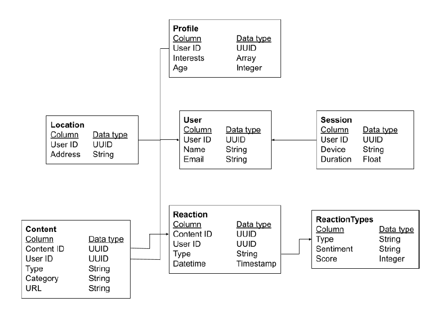
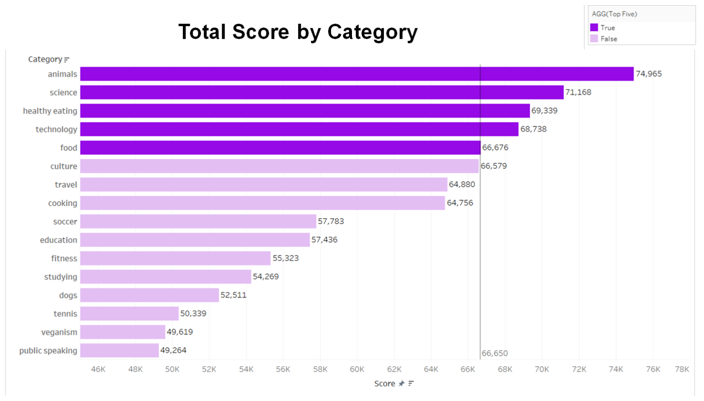
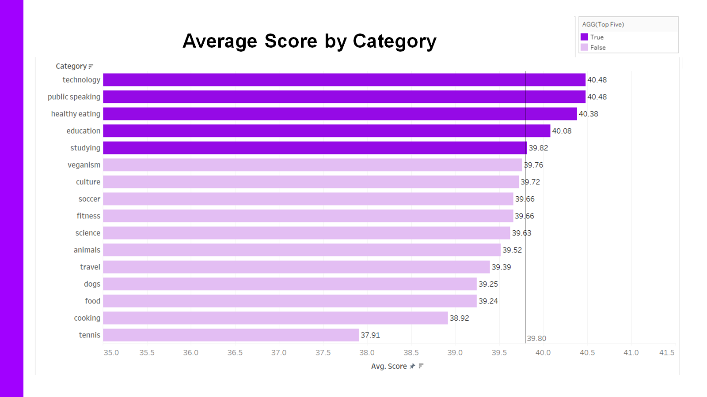

# Social Buzz: Analyzing Popular Categories Using R and Tableau

### Purpose

This is a data project where analysis was performed on the content categories of a social media monitoring company called Social Buzz. I used R programming to clean the data and analyze aggregate data for the top rated categories. I also used Tableau to create charts to help explain the analytical insights, which I presented on PowerPoint slides. I completed this project as part of a Forage virtual job simulation for Accenture data analytics.

### Data Source

The data for this project comes from Accenture as part of a Forage job simulation with the csv files with the raw data.

### Data Structure

Here's a diagram of the data model, showing the relationships between the seven different sets of data.

### Business Problem

- Understanding the business problem and requirements:

  Social Buzz tracks user reactions on social media. Due to recent large scale growth, they are seeking help from an analytics company because they lack resources to manage their large scale growth and they want to learn the best data practices. They are also are looking to complete an IPO because they want to be a publicly traded company. Accenture aims to prove they are the best for the job by doing an audit, making IPO recommendations, and completing data analysis of the top categories. As a simulated data analyst for Accenture, my goal is to analyze the content categories to find the top 5 categories with the largest aggregate popularity, as they had requested in the analytics brief.

- Identifying which tasks should be the focus of the analysis:

  In the data model, popularity is quantified by the reaction score given to each reaction type. So the goal is to find different aggregates of each category’s score. I focus mainly on the sum or total score for each category.

- Identify which data sets will be needed

  To find which categories have the largest aggregate popularity, I used the Content, Content Reation, and Reaction Types data sets. These data sets contain the attributes that describe each post's category, reaction type, score, and date.

### Data Cleaning

Using R programming in R Studio, I imported the data sets, deleted rows with missing data, eliminated unneeded columns, and standardized the category names to avoid duplicate categories in the data.

### Data Analysis

Using R programming again, I merged the data sets so that they were all in one dataframe. Then I grouped the data by category and ran summary statistics for the scores of each category, including sum, mean, median, minimum and maximum scores. This revealed the categories that had the greatest total popularity, and those that had the best average popularity. I also separated the dates into months, years and dates, so I could analyze the date values. This enabled me to group reactions by month, so I could find out which months had the most reactions.

### Data Visualization

Using Tableau, I created 5 charts to help communicate what I had learned in my analysis, including this chart below that shows the five most popular categories by total score.

The other bar charts show the top categories by average score, the number of reactions for each category, and the number of reactions for each month. I also included a scatter plot that shows the close relationship between each category's total score and number of reactions, which is evident by how close the data point remain around the trend line.

### Present Insights

Using Accenture's template, I created a PowerPoint presentation to communicate my analytical findings. The slides help to communicate the business problem and summarizes the main insights. It includes aesthetically pleasing charts that quickly communicate the important points. Also, notice how the colors of my charts match the color theme chosen my Accenture.

### Presentation Video

My next task is to create a short video presentation for presenting the findings to the client and team members.
